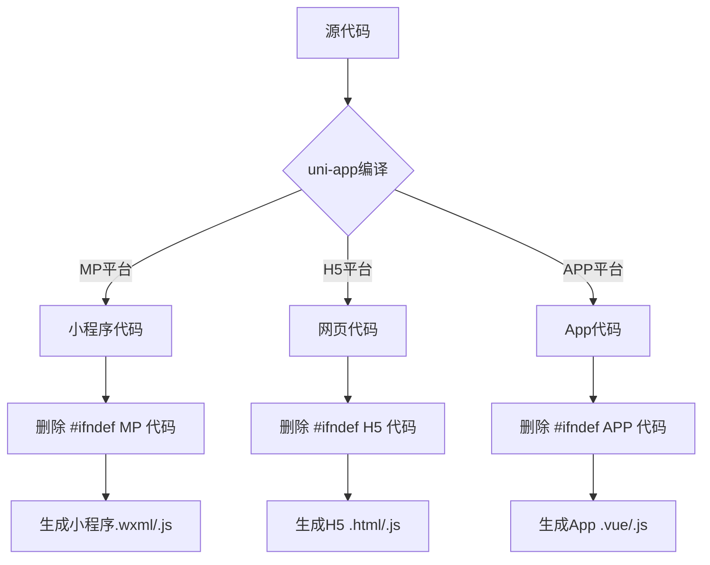

这是 **uni-app 的条件编译语法**，用来在不同平台（H5、小程序、App）编译不同的代码。

## 🎯 语法详解

### 1. **基本格式**

```
<!-- 在 .vue 文件中 -->
<template>
  <!-- #ifdef MP -->
  <view>这段只在小程序平台显示</view>
  <!-- #endif -->
</template>
```

### 2. **平台标识符**

| 平台           | 标识符             | 说明               |
| -------------- | ------------------ | ------------------ |
| 微信小程序     | `MP-WEIXIN`        | 微信小程序         |
| 支付宝小程序   | `MP-ALIPAY`        | 支付宝小程序       |
| 百度小程序     | `MP-BAIDU`         | 百度小程序         |
| 字节小程序     | `MP-TOUTIAO`       | 字节跳动小程序     |
| QQ小程序       | `MP-QQ`            | QQ小程序           |
| 快应用         | `MP-QUICKAPP`      | 快应用             |
| **所有小程序** | `MP`               | 所有小程序平台通用 |
| H5             | `H5`               | 网页端             |
| App            | `APP`              | 移动App            |
| iOS            | `APP-PLUS`或 `IOS` | iOS平台            |
| Android        | `APP-ANDROID`      | Android平台        |

### 3. **组合用法**

```
<!-- 1. 多平台 -->
<!-- #ifdef MP-WEIXIN || MP-ALIPAY -->
<view>微信和支付宝小程序显示</view>
<!-- #endif -->

<!-- 2. 排除某平台 -->
<!-- #ifndef H5 -->
<view>非H5平台显示</view>
<!-- #endif -->

<!-- 3. 多个条件 -->
<!-- #ifdef MP || H5 -->
<view>小程序和H5平台显示</view>
<!-- #endif -->
```

## 📁 实际应用场景

### 场景1：适配不同平台的组件

```
<template>
  <!-- 所有平台通用 -->
  <view class="container">
    
    <!-- 小程序特有 -->
    <!-- #ifdef MP -->
    <view class="mp-header">
      <input class="search" placeholder="小程序搜索框" />
    </view>
    <!-- #endif -->
    
    <!-- H5特有 -->
    <!-- #ifdef H5 -->
    <view class="h5-header">
      <h1>H5网站标题</h1>
    </view>
    <!-- #endif -->
    
    <!-- App特有 -->
    <!-- #ifdef APP-PLUS -->
    <view class="app-header">
      <text>原生APP</text>
    </view>
    <!-- #endif -->
    
  </view>
</template>
```

### 场景2：样式适配

```
<style>
/* 全局样式 */
.container {
  padding: 20rpx;
}

/* 小程序特有样式 */
/* #ifdef MP */
.container {
  margin-top: 44px; /* 小程序状态栏高度 */
}
/* #endif */

/* H5特有样式 */
/* #ifdef H5 */
.container {
  max-width: 750px;
  margin: 0 auto;
}
/* #endif */

/* App特有样式 */
/* #ifdef APP-PLUS */
.container {
  padding-top: var(--status-bar-height);
}
/* #endif */
</style>
```

### 场景3：JS逻辑适配

```
<script>
// 所有平台通用
export default {
  data() {
    return {
      message: 'Hello'
    }
  },
  
  methods: {
    share() {
      // 平台特定代码
      // #ifdef MP
      wx.showShareMenu({
        withShareTicket: true
      })
      // #endif
      
      // #ifdef H5
      alert('H5分享功能')
      // #endif
      
      // #ifdef APP-PLUS
      plus.share.sendWithSystem({
        content: '分享内容'
      })
      // #endif
    }
  }
}
</script>
```

## 🎨 你在代码中看到的示例

```
<!-- 你的代码片段 -->
<!-- #ifdef MP -->
<view class="mp-search-box">
  <input class="ser-input" type="text" value="输入关键字搜索" disabled />
</view>
<!-- #endif -->
```

**意思**：

- 这部分代码**只在小程序平台**编译
- 在其他平台（H5、App）不会编译这部分代码
- 因为小程序的搜索框样式和交互与其他平台不同

## 🔧 编译过程




## 📊 条件编译的常见用途

### 1. **平台特有API**

```
// 获取设备信息
getSystemInfo() {
  // #ifdef MP
  return wx.getSystemInfoSync()
  // #endif
  
  // #ifdef H5
  return {
    platform: 'web',
    windowWidth: window.innerWidth
  }
  // #endif
  
  // #ifdef APP-PLUS
  return plus.device.getInfo()
  // #endif
}
```

### 2. **导航栏适配**

```
<template>
  <!-- 小程序自定义导航栏 -->
  <!-- #ifdef MP -->
  <view class="custom-nav">
    <view class="nav-back" @click="goBack">‹</view>
    <view class="nav-title">{{title}}</view>
  </view>
  <!-- #endif -->
</template>
```

### 3. **分享功能**

```
onShareAppMessage() {
  // 只在小程序生效
  // #ifdef MP
  return {
    title: '分享标题',
    path: '/pages/index/index'
  }
  // #endif
}
```

### 4. **支付功能**

```
pay() {
  // #ifdef MP-WEIXIN
  wx.requestPayment({
    timeStamp: '',
    nonceStr: '',
    package: '',
    signType: 'MD5',
    paySign: ''
  })
  // #endif
  
  // #ifdef MP-ALIPAY
  my.tradePay({
    tradeNO: ''
  })
  // #endif
}
```

## ✅ 总结

**`#ifdef MP`的意思**：

- 这是一个**条件编译**指令
- 表示接下来的代码**只在小程序平台**生效
- 在编译到其他平台（H5、App）时，这段代码会被**删除**

**好处**：

1. 一份代码适配多端
2. 编译时自动处理平台差异
3. 代码更简洁，无需运行时判断
4. 减小各平台包体积

**你的场景**：小程序搜索框样式和H5/App不同，所以用条件编译分别处理。